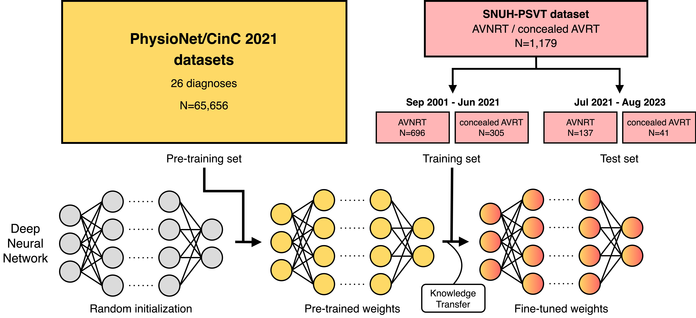

# Classification of Underlying Paroxysmal Supraventricular Tachycardia Types Using Deep Learning of Sinus Rhythm Electrocardiograms

This repository contains the code for the experiments conducted in our research paper titled [*Classification of Underlying Paroxysmal Supraventricular Tachycardia Types Using Deep Learning of Sinus Rhythm Electrocardiograms*](https://journals.sagepub.com/doi/10.1177/20552076241281200).

<p align="center">
    
</p>

Unfortunately, the datasets analyzed in this study are not publicly available due to patient privacy and security concerns.

## Citation
If you find our repository or paper useful, please consider citing our work:

```
@article{kwon2024classification,
    title={Classification of underlying paroxysmal supraventricular tachycardia types using deep learning of sinus rhythm electrocardiograms},
    author={Kwon, Soonil and Suh, Jangwon and Choi, Eue-Keun and Kim, Jimyeong and Ju, Hojin and Ahn, Hyo-Jeong and Kim, Sunhwa and Lee, So-Ryoung and Oh, Seil and Rhee, Wonjong},
    journal={Digital health},
    volume={10},
    pages={20552076241281200},
    year={2024},
    publisher={SAGE Publications Sage UK: London, England}
}
```


## Requirements
All our experiments were implemented with Python 3.8 and PyTorch 1.8.1.

We also tested our code with the following libraries:
- xmltodict 0.13.0
- scikit-learn 1.3.0
- tqdm 4.66.1
- pandas 2.0.3

## Usage
1. `build_cv_folds.py`
- Builds cross-validation folds from samples of concealed AVRT and AVNRT.
- Expected data format: .xml
- This code expects ECG samples of 10 seconds, 500Hz.

```
    python build_cv_folds.py \
        --c_avrt_path /path/to/c_avrt/samples \
        --avnrt_path /path/to/avnrt/samples \
        --save_path /path/to/cross_validation/folds \
        --num_folds 10
```

2. `main.py`
- Performs training and validation, using the specified fold as the validation set and the others as the training set.
```
    python main.py \
        --model ecg_resnet34_psvt \
        --batch_size 32 \
        --lr 1e-4 \
        --epochs 15 \
        --weight_decay 1e-4 \
        --cv_folds_path /path/to/cross_validation/folds \
        --valid_fold_num 0 \
        --num_leads 12 \
        --result_path /path/to/validation/result
```

3. `analyze_all_fold_results.py`
- Aggregates the results of 10-fold cross validation.
```
    python analyze_all_fold_results.py
        --result_path /path/to/validation/result
```

---

Alternatively, after building the cross-validation folds by running `build_cv_folds.py`, you can modify `run_experiments.sh` as needed and execute it.
```
    sh run_experiments.sh
```

